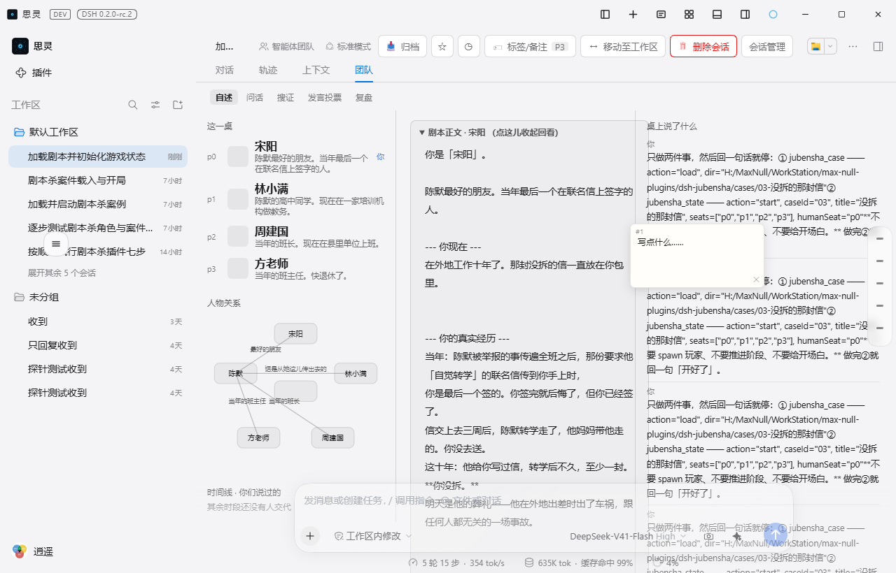
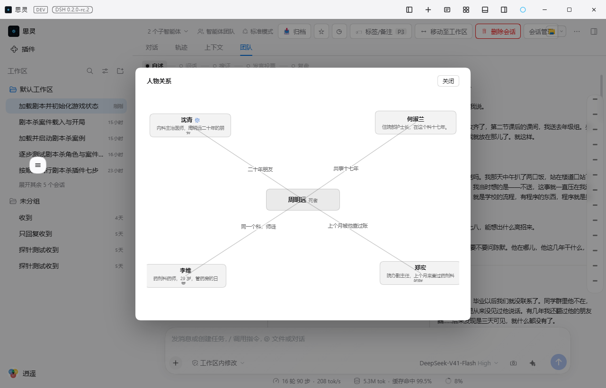
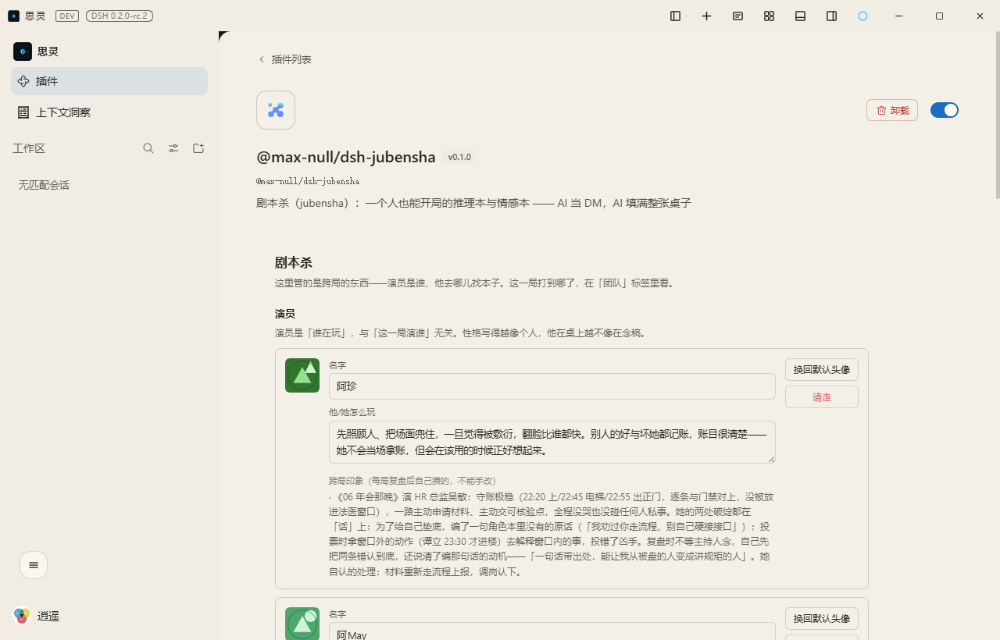

# @max-null/dsh-jubensha

**剧本杀（jubensha）**：一个人也能开局的推理本与情感本 —— AI 当 DM，AI 填满整张桌子。

> 名字用拼音不是偷懒：剧本杀没有对得上的英文词。`murder mystery` 是西式推理小说、
> `LARP` 是实况角色扮演、`social deduction` 是狼人杀那类纯规则游戏 —— 都不对。
> 用拼音等于**拒绝一个错误的类比**：这是中文圈的东西，不是舶来品。

## 它解决什么

剧本杀的真实门槛**不是钱，是人**：四到六个玩家加一个 DM，凑齐一次比票价难得多。

本插件把这个门槛拆掉 —— **你一个人就能开局**：AI 坐 DM 位（它本来就该全知），AI 填满其余的椅子
（它们各自只知道自己的角色本）。留下来的问题是：**AI 玩家像不像人**。这一点已经用三个完整本子
实测过（见 `cases/`），而不是设想。

## 截图

**「团队」标签** —— 与「对话 / 轨迹 / 上下文」并列的那个房间。左栏是这一局的人（座位、人物关系、
时间线），中栏是剧本正文（默认收起）与当前阶段那一页，右栏是桌上说了什么。便签可以留在任意
位置（右键），跟着标签走、按会话存。




**人物关系点开是大图** —— 左栏那 258px 里放的是列表（那个宽度里列表好读），点一下弹窗，里面才
是连线图：死者在正中、四个角色在四角、关系写在线上。窄栏里画不下那张图，而它本来就需要宽度。



**设置页在插件管理里** —— 侧栏「插件」→ 点开 `@max-null/dsh-jubensha` 那张卡片，演员池（名字、
怎么玩、跨局印象）、本子上哪儿找、加目录都在那一页上。它挂的是插件管理给别的插件留的
`plugins.bundle.config` 槽（key 是包名）。



**装完还会多出什么**（行为效果）：

| 变化 | 说明 |
|---|---|
| 一个会话视图标签 | 叫「团队」—— 对话形态唯一的面板给不了的东西，就是「看起来在干别的」 |
| 一个只读端点 | `GET /jubensha/room?session=<id>`，围栏是 loopback + 同源 |
| 三个写端点 | 演员池、便签、本子目录；便签按会话存，另两个跟着这台机器上的人走 |
| 多一个工具面 | 模型能开一局、推进阶段、查局面，而不用把这些记在对话里 |
| 阶段与线索有机器可读的记录 | 复盘直接读事件日志，不再靠 DM 回忆 |
| 玩家 agent 的工具面被收窄 | 它们能说话，但读不到本子文件 —— 由 `jubensha_player` 在创建时收窄 |

## 状态

**骨架与玩家上桌都已跑通，并在真实 DSH 里验证过。**

- **L1**：`typecheck` / `test`（119 条）/ `build` 全绿
- **L2**：在隔离实例里加载成功，四个工具都被模型**真实调用**过
  - `jubensha_state`：先 `start` 再 `show`，参数正确、返回局面正确
  - `jubensha_player`：玩家经 Team 上桌并与 DM 对话五轮；它的模型请求里**只有一种工具面**
    （10 个，跨 5 次请求不变），继承层原有的 146 个（`pwsh` / `read` / `edit` …）已被清掉，
    实际能用的只有 `send_message`
  - `jubensha_case`：照着本子让玩家上桌；封存期取 `truth` 被拒（报错带出路）、`book` 只给
    引用而不给正文，而**玩家确实拿到了角色本**——见下
  - `jubensha_case action="clue"`：三条线索以「可直接贴到桌上」的格式返回，而**只写在
    `supports` 里的那句话，在整个会话里一次都没出现过**；同一局里 `truth` 在复盘前被拒、
    推进到 `reveal` 之后解封（返回里带 `culprit`）
  - `jubensha_player action="relay"`：验到它取回的是那位玩家的**原话**（判据见下）
  - `jubensha_actor action="draft"`：返回的是「该怎么写性格」的两条判据，**不是一段现成的
    性格**；带上 `actor` 时多列那位已有的印象（那是它与「无差别生成一段」的区别所在）
  - **三个正式本子都 `load` 过**，而且 `dir` 给的是**目录**——测的是 `<dir>/case.yml` 那个约定：
    case-01 报一条 warn（林默没有「现在」，见下），case-02 与 case-03 零问题
  - `jubensha_actor`：建演员、记印象、列池子、看档案全通；**重启进程之后仍在**——
    落盘在 `$DSH_HOME/storages/jubensha.json`。带演员上桌也验到了：在**新会话**里 `spawn`
    成功，而玩家子会话收到的第一条消息里，演员段（名字、怎么玩、上局的印象）**排在角色本
    之前**，引用已解成正文（判据取自子会话自己的日志，不是 `spawn` 的返回值）

工具面四项：`jubensha_state`（开一局 / 推进阶段 / 公布线索 / 查看局面）、
`jubensha_player`（让玩家上桌 / 对某位玩家或全桌说话 / 把某位玩家的话转达给其他人 /
请他下桌 / 看桌上都有谁）、
`jubensha_case`（看这本有哪几个座位 / 取某个角色的角色本 / 取线索的牌桌原文 / 取本子的某一段）、
`jubensha_actor`（池子里有谁 / 招一个演员 / 取一份「怎么写性格」的骨架 / 改他怎么玩 /
换头像 / 记一条跨局印象 / 看某人的档案）。
**局面按会话存**（`Map<sessionId, GameState>`）—— 那个标签显示的永远是「这个会话」的那一局，
压缩也不会让别的会话看见或提前解封。

**演员与角色是两层**：角色来自本子，**人**来自演员池，而演员池跨会话活着。**插件自带六位**
（老猫 / 阿珍 / 老孙 / 小何 / 铁哥 / 白姐）——空池子里的「随机」没有意义，而让新用户先自己写六个
性格，门槛比这个插件该有的高得多。补齐**只补缺的**：已经存在的一个字段都不动，那是他自己的东西。
开一局时那一个「随机排」把整桌重排，所以同一个人每局可能坐不同的位子、拿不同的本子——而这正是
跨局印象值得记的理由。同一个演员下一局
可以换座位、换角色本，但他记得前面几局发生过什么——所以档案里记的是「上局被谁骗过」，
**不记座位号**。机制与那次 `cannot get property "storage" without inject` 的排查见
[`docs/设计/2026-10-05-演员与跨局记忆.md`](docs/设计/2026-10-05-演员与跨局记忆.md)。

**房间是会话视图里的一个标签，叫「团队」**（同一个包的浏览器半边）：与「对话 / 轨迹 / 上下文」
并列。显示当前局面、座位表、演员池（含按 id 生成的头像），并能**选本子、给每个位子挑演员、
生成一段开局指令**。它**只生成文本、不自己调工具**：一旦会发号施令，它就从「另一块屏」变成了
「第二条控制通道」，而「界面是附加层」那条约束是靠这个守住的。

**标签名是刻意的**——对话形态唯一的面板给不了的东西，就是「看起来在干别的」（用户原话
「极其隐蔽，适合摸鱼」）。**局面按会话存**（`Map<sessionId, GameState>`），因为标签显示的永远
是「这个会话」的那一局；数据走插件自己的只读端点（`GET /jubensha/room?session=<id>`，围栏是
loopback + 同源）。机制、几处判据与踩过的坑见
[`docs/设计/2026-10-05-房间面板.md`](docs/设计/2026-10-05-房间面板.md)。

**界面已经落到代码里**：设计在
[`docs/设计/2026-10-05-房间与设置-界面设计.md`](docs/设计/2026-10-05-房间与设置-界面设计.md)，
三栏 + 五阶段 + 便签层都在，截图见上。那份文档逐块写了「数据从端点哪个字段来」，而**答不上来的
那几块仍明说没接**（时间线要按座位归集他说过的时段、问话与投票两页的内容、设置页在思灵里的入口）
——那是刻意的：**画一个空壳比空着更糟**。它还记了读会话内容那条路的完整链路（§5.1–5.3）与三个
踩过的坑（§5.4 `ctx.sessions` 的两面性、§5.5 `values()` 而不是 `turnDataSource`、§5.6 探针抄漏了
一行）。

**创意工坊只到预研**：本子是不可信输入，而且是**会进模型上下文**的不可信输入。攻击面与三层建议
（最要紧的是让来源可见）见
[`docs/设计/2026-10-05-创意工坊预研.md`](docs/设计/2026-10-05-创意工坊预研.md)——**一行代码没动**。

**性格可以自己写，也可以让模型给一版**：`action="draft"` 返回的不是一段现成的性格，而是
**该照着什么写**——两条判据来自设计方案 §2.2（写成决策偏好而不是形容词列表；写到「他想选
什么，但实际做成了什么」）。写出来的那条要跨局，所以**必须给人过目再落库**，插件自己不去调
模型。

**头像是生成的**：没配图时按演员 id 画一个内联 SVG 几何图形（同一个 id 永远同一张脸，
所以它是这个人在桌上的记号）；想换就 `action="avatar"` 给一张图，传空串换回来。
生成而不是留空，是因为"不填就没有"等于没做。

**桌面上所有人听得见所有人**：`action="say"` 带 `seat="*"` 是一次说给全桌；
`action="relay"` 把某位玩家刚说的话转给其余人——**用的是他的原话，不是主持人的复述**
（原话由 `tools/result` 钩子当场记下）。机制、那条「玩家一个字都发不出来」的排查，
以及 Team 名册的硬上限见
[`docs/设计/2026-10-05-桌面与信道.md`](docs/设计/2026-10-05-桌面与信道.md)。

**带答案的东西不经过 DM 的上下文**：DM 的思考与工具操作条对玩家是可展开的，所以
「不给」写在工具层——真相与整段线索**封存到复盘**（白名单八段随时可取），角色本走
**引用**（全文留在插件里，上桌时由程序自己解开送进玩家的首条消息）。机制、边界与一次
实测失败的记录见
[`docs/设计/2026-10-05-真相保险箱.md`](docs/设计/2026-10-05-真相保险箱.md)。

**玩家「只能说话」由两层机制保证，不靠 prompt 纪律**：`tools.restrict` 管看不看得见
（继承层），`tools/pre-execute` 管准不准执行（含 agent 自己那层，内核的委派工具就在那里）。
机制、源码位置，以及三次迭代踩过的两个时序坑，见
[`docs/设计/2026-10-05-spawn_player-可行方案.md`](docs/设计/2026-10-05-spawn_player-可行方案.md)。

**本子是可校验的数据**：格式见 [`schema/case.schema.yml`](schema/case.schema.yml)（v1.0），
加载器与它的判据见
[`docs/设计/2026-10-05-本子格式与加载器.md`](docs/设计/2026-10-05-本子格式与加载器.md)。
**三个正式本子都已转成 YAML**，各住在 `cases/<编号>-<名字>/case.yml`；Markdown 手册留着
（那是人写本子时的形态），YAML 是机器读的那一份。

转换不是抄一遍——**填不下去的地方就是本子的缺口**。case-01 就填出了一处：真人那位角色
（林默）没有「现在」，而另外三张角色卡都自带身份。那正是第三局玩家当场问住的同一件事
（「我人物资料呢？我不知道自己现在是在做什么」），而它在这本**最早写的**本子里就存在。
转换没有替它编一句补上：本子该修，但不该由抄的人顺手圆过去——**那会把「本子缺东西」
变成「看起来不缺」**。加载器对它的判定是一条 warn，测试里钉着。

下一步是设计方案 §3.4 余下的信息路由私聊一侧，**本子真开一局的端到端彩排**，以及时间线那一页
（数据源已经通了——右栏正在读会话内容，缺的是「按座位归集他说过的时段」那一层）。

## 安装

```sh
dsh plugin add @max-null/dsh-jubensha
```

## 本子

自带七本。四人的六本（`01` 拾光照相馆 / `02` 深夜电台 / `03` 没拆的那封信 / `04` 三支药 /
`05` 金库的铜带 / `06` 年会那晚），加一本六人的 `07` 夜场 —— **六人那一本的价值不在人多**：
四个人的时候，一个人的不在场证明只能靠别人记不记得；六个人里台前与后台是两条天然的对照线，
五个人的位置能互相咬合，而凶手得在这张网里找一个空档。

本子的格式由 [`schema/case.schema.yml`](schema/case.schema.yml) 定义 —— 它的每一条字段注释
都是从三局实测里**逼出来**的判据，不是先验设计。最要紧的三条：

- **收尾必须有一条物理上不可绕的证据**。自检问句：把真凶放到法庭上，检察官能拿出什么？
  答案是「他撒谎了」→ 本子不合格（他改口"我记错了"就能脱身）。
- **误导负责制造情绪，不负责制造另一种真相**。要给他心理负担，就让他「以为自己做了什么」（主观），
  而不是「客观上真的可能做了什么」（那会造出第二个答案）。
- **动机会自己推着玩家走 —— 出口要修在动机的延长线上**。你给了他「最好的朋友」，这条动机
  必然推他追到底；那就得在那条路上修落点，而不是在旁边另摆一个「共情出口」。

**要写新本子（或者让别的模型写）时，读 skill `jubensha-write-case`** —— 它装的是上面那三样
**机械检查抓不到**的东西：七本里真踩过的五个逻辑坑（每一条都带着是哪一本踩出来的）、
怎么想一个本子的真相与情感落点、四人与六人的差别。写了之后跑这两样：

```bash
node scripts/check-case-syntax.mjs   # 两条 YAML 坑：引号数、* 开头
pnpm test                            # 11 条结构检查：角色六段非空、恰好一个凶手、五个阶段 id…
```

## 已知限制

- **共享工作目录**：所有 AI 玩家与 DM 观察同一个 cwd（Agent Teams 的既有边界）。所以
  **本子的真相手册不得落在工作区内** —— 开局时写到工作区外，散场后归档。
- **角色本不落盘**：只经消息送达对应 agent。落盘就等于任何 agent 都能读到别人的秘密。
- **玩家看得见 10 个工具、只能用 1 个**：那 10 个是走 Team 的必然残留——Team 成员的
  `spawn_teammate` / `team_task_*` / `wait_agent` 等，加上内核的 `subagent`，全都注册在
  **agent 自己那层**，而 `tools.restrict` 按定义只管继承层。安全上没问题（执行前的闸全兜住了），
  代价是占 prompt 空间、可能引它试一次。**「进 roster」与「工具面绝对干净」在机制上不可兼得。**
- **一局结束后 teammate 名字不释放**：同一个 DM 会话里，`p1` 这个名字一个进程只能用一次
  （撞 `TEAM_MEMBER_NAME_TAKEN`）。插件给座位号缀了单调后缀绕开，但团队名册本身是累积的。
- **玩家会出戏**：实测里玩家有几次不发台词，改发「进展（林晚侧）：已向主持人确认口径…」
  这类元层面汇报。上台说明还需要更硬的约束。
- **一个会话打一局**：Team 名册一个会话最多 8 位 teammate，而条目**不可移除**（上限来自
  `experimental/agent-team-profile/cordis.patch.yml` 的 `maxMembers: 8`，内核默认是 16），
  按每局 3 位 AI 玩家算**开不了三局**。约定是**一局一换会话**。（绕开 Team 直接用
  `ctx.subagents.startContinuable` 也能解，但那会丢掉已验证的 Team 实践，不值。）
  **推论**：跨局的连续性只能靠落盘的玩家档案，不能靠会话上下文——见下。
- **封存不是物理隔离**：真相保险箱挡住的是**顺手泄漏**（发角色本必看全座位秘密那条路），
  不是"DM 看不到"。DM 是主 agent，它真要主动 `read` 本子文件，谁也拦不住。判据只有一条：
  **按正常工作流程带局时，答案不流经它的上下文。** 另一半仍未解决——人类玩家这一侧没有
  私聊信道，会话对话就是桌面。
- **跨局的东西目前只有演员池**：局面、座位、玩家登记都随会话消失，所以「跨局记忆」现在到
  「这个人记得什么」为止，还不到「这批人之间的旧账」。演员的**印象靠主持人一局结束时写**
  （`jubensha_actor action="note"`）——他不写，这一局就什么都不剩。

## 待做

- **6 人的本子**：《夜场》（`cases/07-夜场/`）已经写完并在 dev 里完整跑过一局——
  而那一局暴露的六人特有问题还没整理（比如六个人各自那段要能互相咬合，比四人难）。

